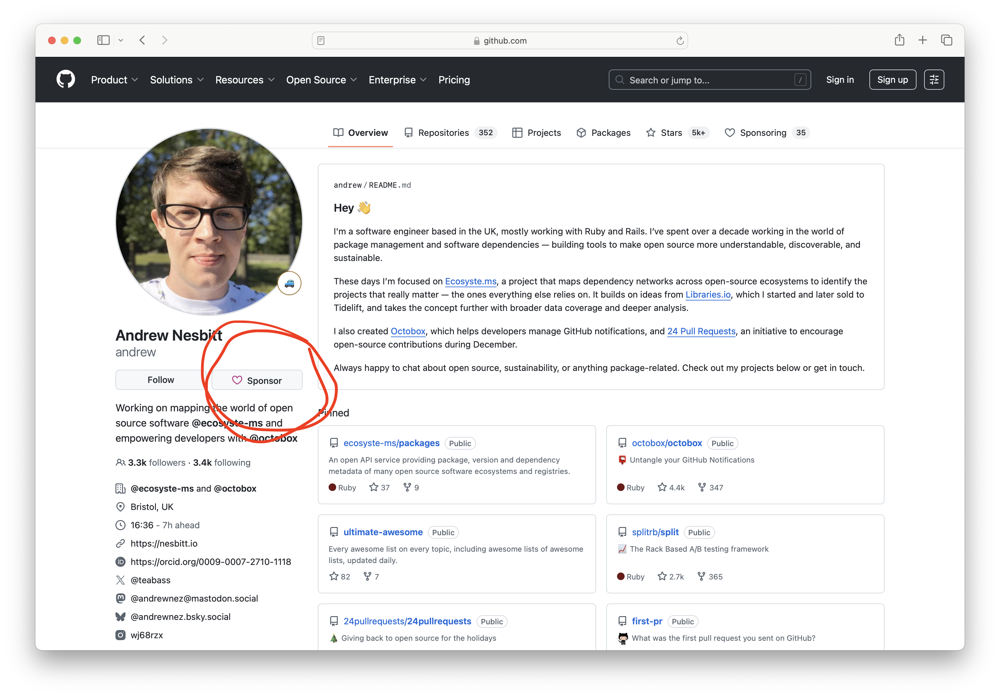
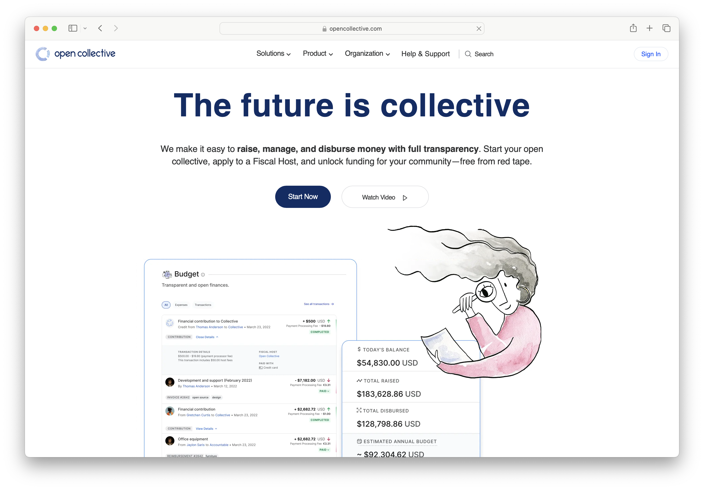
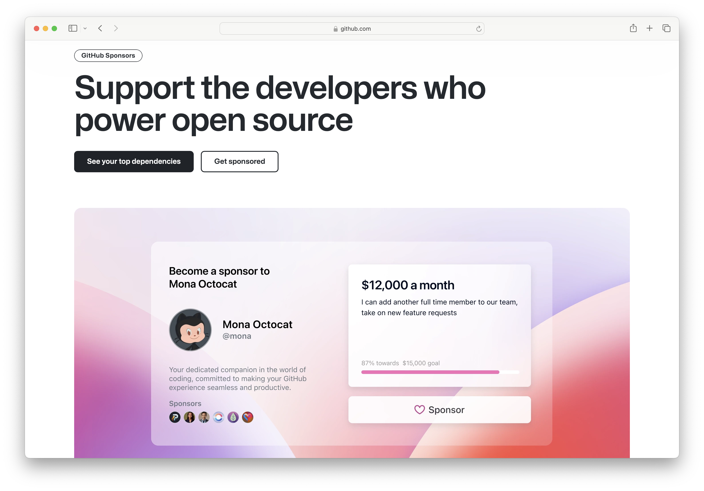

# Intro

# The State of OSS Funding data: Insights from ecosyste.ms

CHAOSScon North America 2025

Denver, CO

# Pop Quiz Warning

There will be a pop quiz at the end of this talk, pay close attention!

# Andrew Nesbitt

 

# I have poodles


# ecosyste.ms


# ecosyste.ms stats

Packages: 11.4M
Versions: 132M
Downloads: 2.0T

Maintainers: 1.7M
Repositories: 262M
Dependencies: 22B

# Funding in Open Source

What data can we see in the ecosyste.ms dataset about funding in open source?

# Different kinds of funding metadata

- Funding links in package metadata
- Funding links in maintainer/org profiles
- Funding.yml files in repositories

# FUNDING.yml

```
github: andrew
ko_fi: andrewnez
polar: andrew
buy_me_a_coffee: andrewnez
```

# Funding metadata in Package Managers

```
- Rubygems: ["funding_uri"]
- npm: ["funding"]
- PyPI: ["funding"]
- Packagist: ["info"]["project_urls"]["Funding"]
```

# Funding metadata in Maintainer Profiles



# Funding Links

- https://github.com/sponsors/andrew
- https://ko-fi.com/andrewnez
- https://polar.sh/andrew
- https://buymeacoffee.com/andrewnez
- https://paypal.me/andrewnez
- https://sindresorhus.com/donate
- https://tidelift.com/funding/github/npm/gzip-size
- https://donate.pypi.org
- https://www.patreon.com/garbagebrainuniversity

# Lets go through some data!

Here's something I prepared earlier...

I've been mining the ecosyste.ms datasets for funding links in open source packages.

# Funding links in all packages

Packages: 376,892
Percent: 3.26%

# Most Popular Funding Domains

- [github.com](https://github.com) — 315,034 funded packages (83.59%)
- [opencollective.com](https://opencollective.com) — 49,467 funded packages (13.12%)
- [patreon.com](https://patreon.com) — 26,929 funded packages (7.15%)
- [ko-fi.com](https://ko-fi.com) — 17,674 funded packages (4.69%)
- [paypal.me](https://paypal.me) — 15,170 funded packages (4.03%)
- [buymeacoffee.com](https://buymeacoffee.com) — 11,497 funded packages (3.05%)
- [tidelift.com](https://tidelift.com) — 10,686 funded packages (2.84%)
- [liberapay.com](https://liberapay.com) — 6,353 funded packages (1.69%)
- [paypal.com](https://paypal.com) — 3,505 funded packages (0.93%)
- [donate.pypi.org](https://donate.pypi.org) — 3,179 funded packages (0.84%)
- [sindresorhus.com](https://sindresorhus.com) — 2,442 funded packages (0.65%)

# Top Ecosystems by Number of Funded Packages

- [npmjs.org](https://npmjs.org) — 150,926 funded packages (3.0%)
- [pypi.org](https://pypi.org) — 49,172 funded packages (7.07%)
- [proxy.golang.org](https://proxy.golang.org) — 40,169 funded packages (2.11%)
- [packagist.org](https://packagist.org) — 29,776 funded packages (6.49%)
- [repo1.maven.org](https://repo1.maven.org) — 25,560 funded packages (4.88%)
- [nuget.org](https://nuget.org) — 18,964 funded packages (2.61%)
- [crates.io](https://crates.io) — 18,899 funded packages (9.74%)
- [rubygems.org](https://rubygems.org) — 7,068 funded packages (3.56%)
- [bower.io](https://bower.io) — 3,143 funded packages (4.48%)
- [github actions](https://github.com/features/actions) — 2,946 funded packages (9.22%)
- [pub.dev](https://pub.dev) — 2,803 funded packages (4.24%)

# Critical Packages

The critical packages are the top <b>~10,000</b> most used packages.

-

<b>"Most Used"</b> a combination of the number of packages, repositories that depend on them and the number of downloads.

-

This small group of packages represent over <b>~80%</b> of all usage.

-

That means only <b>0.0865%</b> of all packages are critical.

# 1% of the 1%


# 80% of all usage


# Critical Package Funding Links

Packages: 2,661
Percent: 27.2%

# Average Funding Links per Critical Packages

Links: ~2

# Critical Packages with more than One Funding Link

Packages: 1,411

# Funding Domains in Critical Packages

- [github.com](https://github.com) — 2,288 funded packages (86.0%)
- [opencollective.com](https://opencollective.com) — 851 funded packages (32.0%)
- [tidelift.com](https://tidelift.com) — 571 funded packages (21.5%)
- [sindresorhus.com](https://sindresorhus.com) — 182 funded packages (6.8%)
- [patreon.com](https://patreon.com) — 129 funded packages (4.8%)
- [symfony.com](https://symfony.com) — 98 funded packages (3.7%)
- [buymeacoffee.com](https://buymeacoffee.com) — 91 funded packages (3.4%)
- [thanks.dev](https://thanks.dev) — 61 funded packages (2.3%)
- [ko-fi.com](https://ko-fi.com) — 61 funded packages (2.3%)
- [liberapay.com](https://liberapay.com) — 50 funded packages (1.9%)
- [paypal.me](https://paypal.me) — 45 funded packages (1.7%)

# Ecosystems by Funded Critical Packages

- [npmjs.org](https://npmjs.org) — 1,252 of 2,289 critical packages have funding (54.7%)
- [packagist.org](https://packagist.org) — 303 of 548 critical packages have funding (55.29%)
- [crates.io](https://crates.io) — 197 of 813 critical packages have funding (24.23%)
- [pypi.org](https://pypi.org) — 196 of 525 critical packages have funding (37.33%)
- [rubygems.org](https://rubygems.org) — 183 of 974 critical packages have funding (18.79%)
- [conda-forge.org](https://conda-forge.org) — 102 of 390 critical packages have funding (26.15%)
- [clojars.org](https://clojars.org) — 81 of 280 critical packages have funding (28.93%)
- [repo1.maven.org](https://repo1.maven.org) — 79 of 704 critical packages have funding (11.22%)
- [proxy.golang.org](https://proxy.golang.org) — 68 of 645 critical packages have funding (10.54%)
- [swiftpackageindex.com](https://swiftpackageindex.com) — 38 of 97 critical packages have funding (39.18%)
- [juliahub.com](https://juliahub.com) — 19 of 173 critical packages have funding (10.98%)

# Let's go deeper into data

What data is available for some of these funding platforms.

# Open Collective

 

# Collectives linked in Critical Packages

Collectives: 150

# Average Packages from a Collective

- Mean: 5.78
- Median: 1.0
- Mode: 1
- Min: 1
- Max: 182
- Std-dev: 19
- 90th percentile: 8
- 95th percentile: 20

# Donation stats in Critical Collectives

- Total donations: $11,070,063
- Total expensed: $9,393,780
- Current balance: $2,401,580
- Total transactions: 221,238
- Average transaction: $90

# Collective Donations

- Mean: $82,612.41
- Median: $12,889.20
- Mode: $42,746.16
- Min: $0.00
- Max: $1,665,827.27
- Std-dev: $217,800.24
- 90th percentile: $177,971.63
- 95th percentile: $343,736.23

# Top Critical Collectives

- webpack: $1,665,827.27
- babel: $1,383,653.29
- eslint: $922,377.59
- vuejs: $728,887.79
- generator-jhipster: $420,678.85
- mui-org: $394,203.27
- homebrew: $343,736.23
- curl: $341,781.62
- numpy: $297,794.59
- date-fns: $273,985.56

# Critical Collectives with Zero Donations

Collectives: 2

# GitHub Sponsors



# GitHub Sponsors linked from Critical Packages 

Sponsored: 667

# GitHub Sponsor Averages

- Mean: 3.7 
- Median: 1
- Max: 190
- Std-dev: 11.9
- 95% have ≤ 10 packages

# GitHub Sponsor Stats

- number of accounts with active sponsors: 580
- number of the accounts with any sponsors: 607
- number of accounts with no sponsors: 60
- number of accounts with no active sponsors: 87

# Organisations vs User GitHub Sponsor Accounts

- Organisations: 122 (18%)
- Users: 519 (78%)
- Not on GitHub Sponsors: 19 (3%)

# GitHub Accounts with Most Active Sponsors

- homebrew - 791 active sponsors
- antfu - 213 active sponsors
- sebastianbergmann - 209 active sponsors
- sindresorhus - 207 active sponsors
- python - 197 active sponsors
- yyx990803 - 191 active sponsors
- tiangolo - 157 active sponsors
- dtolnay - 156 active sponsors
- django - 155 active sponsors
- tokio-rs - 138 active sponsors

# GitHub Accounts with Most Sponsors over all time

- homebrew - 2,787 total sponsors
- sindresorhus - 1,792 total sponsors
- livewire - 1,691 total sponsors
- yyx990803 - 1,252 total sponsors
- antfu - 975 total sponsors
- python - 865 total sponsors
- babel - 834 total sponsors
- tiangolo - 769 total sponsors
- sebastianbergmann - 615 total sponsors
- django - 567 total sponsors

# Sponsor Breakdown

Total: 21,942
Users: 20,455
Organization: 1,401

# Let's look at Owners

Who owns these packages? Who are the maintainers? Who are the organisations?

# Critical Package Owners

Packages: 9,780  
Repositories: 6,390
Owners: 2,812

# Breakdown of Owners of critical packages

Organisations: 65%
Users: 35%

# Unique Owners of critical packages

Organisations: 1,312
Users: 1,500

# Top Organisation Owners

- aws - 287 packages (3.5%)
- babel - 139 packages (1.7%)
- symfony - 98 packages (1.2%)
- spring-projects - 91 packages (1.11%)
- googleapis - 78 packages (0.95%)
- DefinitelyTyped - 75 packages (0.92%)
- r-lib - 69 packages (0.84%)
- google - 62 packages (0.76%)
- dart-lang - 60 packages (0.73%)
- smithy-lang - 59 packages (0.72%)

# Top User Owners

- sindresorhus - 181 packages (2.21%)
- jonschlinkert - 57 packages (0.7%)
- ekmett - 44 packages (0.54%)
- dtolnay - 32 packages (0.39%)
- ljharb - 32 packages (0.39%)
- isaacs - 31 packages (0.38%)
- vincenthz - 28 packages (0.34%)
- sebastianbergmann - 26 packages (0.32%)
- snoyberg - 24 packages (0.29%)
- evanw - 24 packages (0.29%)

# Unique Owners with Funding Links

Users: 415
Organisations: 359

# Organisation Owners with Funding Links

- babel - 139 packages (5.26%)
- symfony - 98 packages (3.71%)
- jestjs - 49 packages (1.85%)
- inspect-js - 49 packages (1.85%)
- es-shims - 30 packages (1.14%)
- cssnano - 30 packages (1.14%)
- tokio-rs - 28 packages (1.06%)
- csstools - 26 packages (0.98%)
- micromark - 21 packages (0.79%)
- getsentry - 20 packages (0.76%)

# User Owners with Funding Links

- sindresorhus - 181 packages (6.85%)
- jonschlinkert - 57 packages (2.16%)
- ljharb - 32 packages (1.21%)
- dtolnay - 32 packages (1.21%)
- isaacs - 31 packages (1.17%)
- sebastianbergmann - 26 packages (0.98%)
- weavejester - 21 packages (0.79%)
- mafintosh - 18 packages (0.68%)
- blakeembrey - 17 packages (0.64%)
- mathiasbynens - 16 packages (0.61%)

# User Owners by "company" field

- brandscale - 61 critical packages (0.62%)
- google - 60 critical packages (0.61%)
- groq - 44 critical packages (0.45%)
- 0xf9ba143b95ff6d82 - 32 critical packages (0.33%)
- herodevs tc39 - 32 critical packages (0.33%)
- vlt.sh - 31 critical packages (0.32%)
- coretype - 28 critical packages (0.29%)
- thephpcc - 26 critical packages (0.27%)
- fpco - 26 critical packages (0.27%)
- boolean knot ltd - 21 critical packages (0.21%)
- holepunchto - 18 critical packages (0.18%)

# Summary

- <b>35% of critical packages</b> are owned by individual maintainers, not organizations
- Only <b>27.2% of critical packages</b> have any funding links at all
- <b>72.8% of critical packages</b> have no obvious way to financially support them
- The maintainers with the <b>most</b> funding success have <b>more</b> critical packages
- <b>Concentration effect</b>: Well-funded maintainers can afford to maintain more projects, while unfunded maintainers struggle with even one
- <b>Potential gamification</b>: Some maintainers might strategically break packages into smaller dependencies to increase their critical package count

# Things that didn't fit in a 15 min talk

- Foundations
- Grants
- Contributors
- Commit data
- Issue data
- Dependency linking data

# Pop Quiz


How many times was sindresorhus mentioned in the talk?

# Answer: 7

- Funding Links: - https://sindresorhus.com/donate
- Funding domains in all packages: [sindresorhus.com](https://sindresorhus.com) — 2,442 funded packages (0.65%)
- Funding domains in critical packages: - [sindresorhus.com](https://sindresorhus.com) — 182 funded packages (6.8%)
- GitHub accounts with most active sponsors:- sindresorhus - 207 active sponsors
- GitHub accounts with most sponsors all time: - sindresorhus - 1792 total sponsors
- Top user owners: - sindresorhus - 181 packages (2.21%)
- User owners with funding links: - sindresorhus - 181 packages (6.85%)

# Links

- https://packages.ecosyste.ms
- https://packages.ecosyste.ms/funding
- https://packages.ecosyste.ms/critical
- https://opencollective.ecosyste.ms
- https://sponsors.ecosyste.ms

# We won't have time for questions!

- Web: https://ecosyste.ms
- Email: hello@ecosyste.ms
- GitHub: https://github.com/ecosyste-ms
- Mastodon: https://mastodon.social/@ecosystems